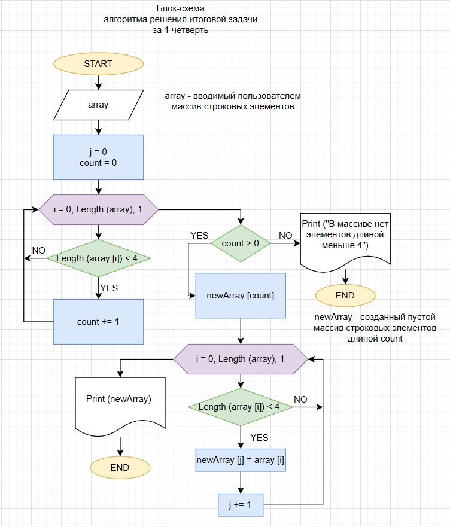

## Описание решения итоговой задачи:
---
### 1. Пользователь вводит с клавиатуры массив строковых элементов.

### 2. Программа подсчитывает количество элементов массива, длина которых меньше 4 символов:
* #### по очереди перебирает элементы массива и сравнивает их длину с 4;
* ##### если длина элемента массива меньше 4, то увеличивает переменную счетчик на 1 переходит к следующему элементу, иначе - сразу переходит к следующему элементу.
### 3. Если переменная счетчик равна 0, то выводит сообщение: **"В заданном массиве нет элементов, длина которых меньше 4"**.
            
    *Конец ветки программы*
  
### 4. Если счетчик больше нуля, то программа:
* #### создает новый массив строковых элементов размером равным значению переременной счетчика;
* #### по очереди перебирает элементы массива, заданного пользователем, и сравнивает их длину с 4;
* ##### если длина элемента массива меньше 4, то значение элемента массива, заданного пользователем, присваивается значению элемента массива, созданного программой, и увеличивает счетчик этого массива на 1, переходит к следующему элементу, иначе - сразу переходит к следующему элементу массива;
* #### выводит на экран значение массива, созданного программой.

    *Конец ветки программы*

### Блок-схема решения

